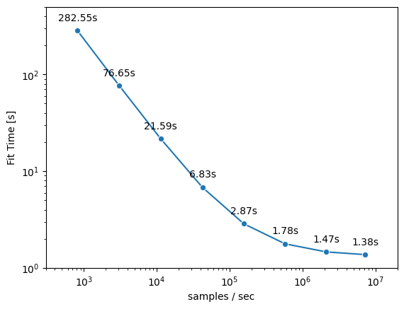

# arrayloaders

> [!CAUTION]
> This pacakge does not have a stable API.  However, we do not anticipate the on-disk format to change as it is simply an anndata file.

[![Tests][badge-tests]][tests]
[![Documentation][badge-docs]][documentation]

[badge-tests]: https://img.shields.io/github/actions/workflow/status/laminlabs/arrayloaders/test.yaml?branch=main

[badge-docs]: https://img.shields.io/readthedocs/arrayloaders

A minibatch loader for anndata store

## Getting started

Please refer to the [documentation][],
in particular, the [API documentation][].

## Installation

You need to have Python 3.10 or newer installed on your system.
If you don't have Python installed, we recommend installing [uv][].

There are several alternative options to install arrayloaders:

<!--
1) Install the latest release of `arrayloaders` from [PyPI][]:

```bash
pip install arrayloaders
```
-->

1. Install the latest development version:

```bash
pip install git+https://github.com/laminlabs/arrayloaders.git@main
```

## Basic usage example

First, you'll need to convert your existing `.h5ad` files into a zarr-backed anndata format.
In the process, the data gets shuffled and is distributed across several anndata files.

### Preprocessing

```python
from arrayloaders import create_store_from_h5ads

create_store_from_h5ads(
    adata_paths=[
        "path/to/your/file1.h5ad",
        "path/to/your/file2.h5ad"
    ],
    output_path="path/to/output/store", # a directory containing `chunk_{i}.zarr`
    shuffle=True,  # shuffling is needed if you want to use chunked access
)
```

### Data loading

You can use the the `arrayloaders` dataset iterator in two settings:

* Chunked access: Better performance, no control oversampling strategy (only random access).
* User configurable sampling strategy: Less performant (~4x slower), but full control over sampling strategy.

#### Chunked access

```python
from pathlib import Path

import anndata as ad
import zarr
import zarrs

zarr.config.set(
    {"codec_pipeline.path": "zarrs.ZarrsCodecPipeline"}
)

from arrayloaders import ZarrSparseDataset

PATH_TO_STORE = Path("path/to/output/store")

ds = ZarrSparseDataset(
    batch_size=4096,
    chunk_size=32,
    preload_nchunks=256,
).add_anndatas(
    [
        ad.AnnData(
            X=ad.io.sparse_dataset(zarr.open(p)["X"]),
            obs=ad.io.read_elem(zarr.open(p)["obs"]),
        )
        for p in PATH_TO_STORE.glob("*.zarr")
    ],
    obs_keys="label_column",
)

# Iterate over dataloader
for batch in ds:
    ...
```

For performance reasons, you should use our dataloader directly without wrapping it into a {class}`torch.utils.data.dataloader`.
Your code will work the same way as with a {class}`torch.utils.data.dataloader`, but you will get better performance.

#### User configurable sampling strategy

At the moment we do not support user-configurable sampling strategies like weighting or sampling.
With a pre-shuffled store and blocked access, your model fit should not be affected by using chunked access.

If you are interested in contributing this feature to the project or leaning more, please get in touch on [zulip](https://scverse.zulipchat.com/) or via the GitHub issues here.

## Speed comparison to other dataloaders

We provide a quickstart notebook that gives both some boilerplate code and provides a speed comparison to other comparable dataloaders:

TODO: figure and notebook

## Why data loading speed matters?

Most models for scRNA-seq data are pretty small in terms of model size compared to models in other domains like computer vision or natural language processing.
This size differential puts significantly more pressure on the data loading pipeline to fully utilize a modern GPU.
Intuitively, if the model is small, doing the actual computation is relatively fast.
Hence, to keep the GPU fully utilized, the data loading needs to be a lot faster.

As an illustrative, example let's train a logistic regression model ([notebook hosted on LaminHub](https://lamin.ai/laminlabs/arrayloader-benchmarks/transform/cV00NQStCAzA?filter%5Band%5D%5B0%5D%5Bor%5D%5B0%5D%5Bbranch.name%5D%5Beq%5D=main&filter%5Band%5D%5B1%5D%5Bor%5D%5B0%5D%5Bis_latest%5D%5Beq%5D=true)).
Our example model has 20.000 input features and 100 output classes. We can now look how the total fit time changes with data loading speed:



From the graph we can see that the fit time can be decreased substantially with faster data loading speeds (several orders of magnitude).
E.g. we are able to reduce the fit time from ~280s for a data loading speed of ~1000 samples/sec to ~1.5s for a data loading speed of ~1.000.000 samples/sec.
This speedup is more than 100x and shows the significant impact data loading has on total training time.

## When would you use this data laoder?

As we just showed, data loading speed matters for small models (e.g., on the order of an scVI model, but perhaps not a "foundation model").
But loading minibatches of bytes off desk will be almost certainly slower than loading them from an in-memory source.
Thus, as a first step to assessing your needs, if your data fits in memory, load it into memory.
However, once you have too much data to fit into memory, for whatever reason, the data loading functionality offered here can provide significant speedups over state of the art out-of-core dataloaders.

## Release notes

See the [changelog][].

## Contact

For questions and help requests, you can reach out in the [scverse discourse][].
If you found a bug, please use the [issue tracker][].

## Citation

> t.b.a

[uv]: https://github.com/astral-sh/uv

[scverse discourse]: https://discourse.scverse.org/

[issue tracker]: https://github.com/laminlabs/arrayloaders/issues

[tests]: https://github.com/laminlabs/arrayloaders/actions/workflows/test.yaml

[documentation]: https://arrayloaders.readthedocs.io

[changelog]: https://arrayloaders.readthedocs.io/en/latest/changelog.html

[api documentation]: https://arrayloaders.readthedocs.io/en/latest/api.html

[pypi]: https://pypi.org/project/arrayloaders
